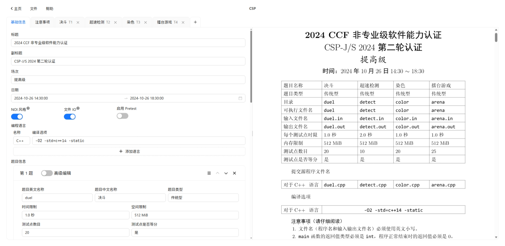

# CNOI Statement Generator

[](https://github.com/Mr-Python-in-China/cnoi-statement-generator)
[](https://github.com/Mr-Python-in-China/cnoi-statement-generator/releases/latest)
[>)](https://github.com/Mr-Python-in-China/cnoi-statement-generator/commits/dev/)
[](https://deepwiki.com/Mr-Python-in-China/cnoi-statement-generator)

<https://cnoi.mrpython.top>

在浏览器中快速将 Markdown 格式的题目转为 tuack 风格的 PDF 文件。



## 特色

- [x] 完全静态网站，所有计算均在浏览器中进行
- [x] 与 tuack 几乎完全相同的格式
- [x] 使用 Markdown 编写题面
- [x] 在线编辑和实时预览功能
- [x] 自动将你的工作保存在浏览器中
- [x] 导入、导出配置，与其他人分享更方便
- [x] 支持直接从本地上传图片，无需图床
- [x] 无需体积达 4GB 的 latex 环境，下载约 30MB 的文件即可在浏览器中运行
- [x] 支持设置图片大小
- [x] 支持单元格合并
- [x] 预制模板提供参考
- [x] 制作演示文稿，可用于赛后讲评等
- [x] ~~可爱的罗小黑~~
- [x] 开源、完全免费！

## 兼容性

目前已经测试了以下浏览器。如果你的浏览器版本过旧，可能无法正常打开，请及时更新浏览器。

- Firefox 88+
- Google Chrome 88+
- Microsoft Edge 88+
- Opera 75+
- Safari 16+

## 贡献

对网站的问题反馈与新功能请求都可以到 <https://github.com/Mr-Python-in-China/cnoi-statement-generator/issues> 中提出。反馈问题时请详细描述你的浏览器版本和遇到的问题，并附有复现步骤和屏幕截图。不熟悉 github 的用户也可以直接通过 [洛谷](https://www.luogu.com.cn/user/679581) 中私信联系我。

如果你想要提交 PR，建议先开 issue 沟通相关细节后再进行。

## 开发与部署

项目是使用 Vite + React 构建的单页应用。题目数据先通过 unified 生态工具链将 markdown 转换为 typst 源码，再通过 [typst.ts](https://github.com/Myriad-Dreamin/typst.ts) 编译为 SVG 并渲染。你可以通过 [deepwiki](https://deepwiki.com/Mr-Python-in-China/cnoi-statement-generator) 让 AI 为你讲解详细内容。

要想编译此项目，你需要 Node.js 22+ ~~低版本可能能用，没试过~~。使用以下命令构建页面：

```shell
npm install
npm run build
```

产物将输出到 `./dist` 目录下。使用任意静态服务器对外公开该目录即可。

## 许可证

本项目参考了 [tuack](https://gitee.com/mulab/oi_tools) 中的模板文件，根据 GPL 协议的传染性，以及结合本项目为 web 服务的性质，使用 AGPL 3.0 协议。详细条款请见 [LICENSE](./LICENSE) 文件。
