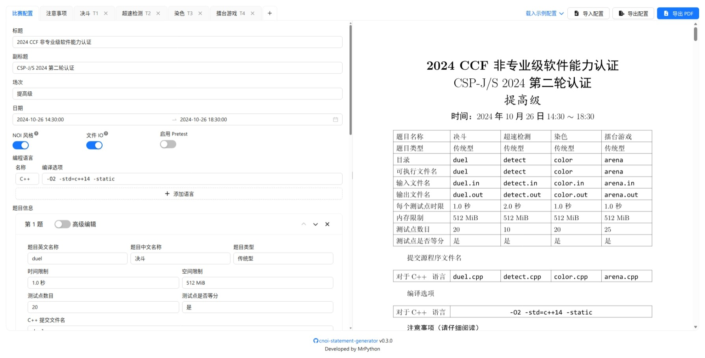

# CNOI Statement Generator

 
  

<https://cnoi.mrpython.top>

在浏览器中快速将 Markdown 格式的题目转为 tuack 风格的 PDF 文件。

## 许可证

本项目参考了 [tuack](https://gitee.com/mulab/oi_tools) 中的模板文件，根据 GPL 协议的传染性，以及结合本项目为 web 服务的性质，使用 AGPL 3.0 协议。详细条款请见 [LICENSE](./LICENSE) 文件。
